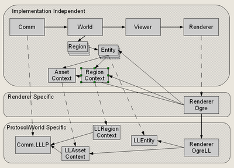

# Architecture

KeeKee is organized around a **World**.
The **World** holds **Regions** which hold **Entitys** that are in the regions.
One or more **Comm** modules communication with some virtual world service
and place **Entities** into the **Regions**.
There are one or more Viewers which watch the world and display the Entities therein.

The current version of KeeKee has :

- one Comm module which uses the [LibreMetaverse] library to talk Linden Lab Legacy Protocol ("LLLP") and
- one Viewer that uses a Renderer which uses the [OpenTK] library for display.

Future expansions will have communication for other virtual worlds as
well as viewers and renderers for other libraries and displays.

The interface to the KeeKee components is through REST/JSON interfaces.
For instance, Comm.LLLP has an interface that allows logging in and out
as status for a connection to such virtual worlds.
Other parts of KeeKee make their status available through such interfaces (see the KeeKee.Rest routines).

KeeKee's internal structure is to have classes that present a server/renderer
independent representation of a world filled with regions and entities.
The implementation independent classes are backed by renderer and server
dependent sub-classes that connect and convert that data from the server.
Because the renderer needs to be tightly tied to the server data formats,
the server specific portions of the renderer reach back into the server
specific sub-classes and convert the data for the renderer.
Below is a diagram of some of the classes and sub-classes that initially implement this structure.

## Top Level Components

### Region

The world is made up of Regions.
The name "region" should not imply that it is a particular geographic or
spacial unit although it can be used that way (in the LL world, for instance).
The general definition of a region is a collection of entities.
A region has a base world coordinate and the entities in that region are
relative to the base of the region.
Regions can overlap so, for instance, a set of regions with identical
base coordinates can be used to classify entities in a spacial area.

Regions have a level-of-detail ("LOD").
A RegionManager (note: as of 20260110, there is not yet a RegionManager implementation)
acts on the regions in the world to change to level-of-detail for the regions.
The effect is usually to keep regions close to the agent in high
level-of-detail while making regions far away from the agent low level-of-detail.
This LOD information passes through the viewer into the renderer to load
and unload the displayed objects in the regions.

### Entity

The Entity is the basic thing in the world.
An entity might have a high level type (basic, avatar) but most of an
entity's character comes from its contexts.
Each Entity has a Region Context (the space unit it is in) and an
Asset Context (the asset system to resolve this entity's needs).

Additionally, an Entity is decorated with additional **components** --
objects can be added by modules to track the module specific state of the Entity.
These include position, avatar actions, and renderer specific data.

One of the difficult architectural questions is how to pass virtual
world specific information (3d object definition, for instance)
from Comm to the Renderer without muddling up the World with many
implementation specific variables.
The combination of the contexts and additional attributes allows Comm
to build an Entity with implementation specific information that can
be transparently passed through the world and used by the Renderer if it understands them.

### World Module

The world is a container who manages a collection of Regions that contain Entities.
World will manage creation and destruction of Regions --
it has the job of managing the local store of virtual world storage.

The World implements Regions which are 3D areas which contain the Entities.
Entities within a Region are managed as a group
(destroyed all at once, for instance)
but there is no presumption about the size or overlapping of Regions.
For instance, it would be completely possible to have two Regions which
overlapped and each holding some of the Entities that appear in a
particular 3D space.
Comm.LLLL implements a simulator region as a KeeKee region thus creating
a grid of non-overlapping land areas.

### Communication Module

The Comm module's job is talking with an external virtual world,
receiving information about entities to display in the client,
creating the proper Entity object and placing it in the World.
Comm does not have any knowledge about how an Entity might be displayed.
It only performs the actions of creating and managing Entities it places in the world.

### Viewer Module

### Renderer Module

### Agent

There is a concept of an agent who is focus of display and action
in the world.
The location of the agent is used for the level-of-detail calculations for entity display.

### Framework

All components exist within a framework of services.

### User Interface

KeeKee is controlled through several HTTP/REST/JSON interfaces
which return statistics and change the operation of the viewer.
The interfaces are all accessed via HTTP GET and POST operations
which store and return JSON formatted messages.

See other pages for the format of the REST messages for
Statistics, Chat, Login and Logout, Active Avatars.
Someday there will be [OpenAPI] specifications for them.

[LibreMetaverse]: https://github.com/cinderblocks/libremetaverse
[Mozilla License]: https://www.mozilla.org/en-US/MPL/
[OpenAPI]: https://openapis.org
[OpenSimulator]: http://opensimulator.org
[OpenTK]: https://opentk.net
[SecondLife(r)]: https://secondlife.com

